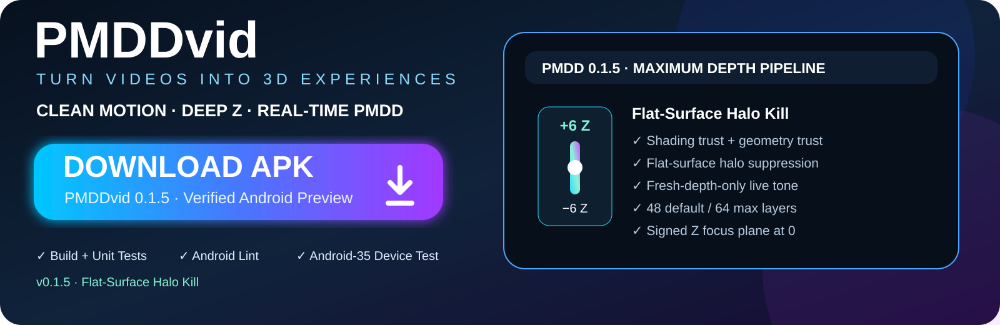
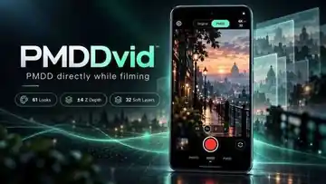
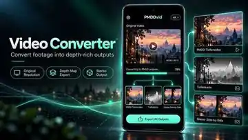
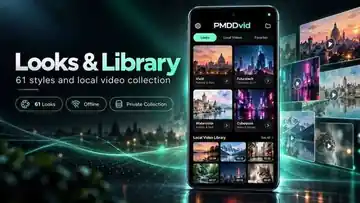

[](https://github.com/chekento/PMDDvid/releases/download/v0.1.5/PMDDvid-0.1.5.apk)

# PMDDvid

<p align="center"></p>


[](LICENSE)

**PMDD direkt beim Filmen.** Native Android-Videokamera von Kolja Werner Schumann (KoSch), entwickelt mit ChatGPT. Die Oberfläche und die fotografische Tiefengestaltung orientieren sich an [PMDDcam 0.4.0](https://github.com/chekento/PMDDcam). Der Video-Konverter ist ein zusätzliches Werkzeug.

> **0.1.5 · Android Preview — aktueller geprüfter Build:** [APK direkt herunterladen](https://github.com/chekento/PMDDvid/releases/download/v0.1.5/PMDDvid-0.1.5.apk) · [SHA-256](https://github.com/chekento/PMDDvid/releases/download/v0.1.5/SHA256SUMS.txt) · [Release v0.1.5](https://github.com/chekento/PMDDvid/releases/tag/v0.1.5) · [erfolgreicher Build + Android-Gerätetest](https://github.com/chekento/PMDDvid/actions/runs/37208916515). Die Preview ist noch keine Freigabe für alle Android-Geräte.

## App Preview

<table>
<tr>
<td width="50%"></td>
<td width="50%"></td>
</tr>
<tr>
<td width="50%"></td>
<td width="50%"></td>
</tr>
</table>

## Filmen

- Dunkle Vollbildkamera, Mint-Akzente, drei kompakte Menüs und direkter Original/PMDD-Umschalter.
- Rück- und Frontkamera, Tippen zum Fokussieren, Zwei-Finger-Zoom, Drittelraster und Dauerlicht, soweit die Kamera es unterstützt.
- HD, Full HD oder UHD. Eine nicht verfügbare Aufnahmeauflösung wird gemeldet; die unterstützte Auswahl wird angezeigt.
- PMDD verarbeitet **Vorschau und aufgezeichnete Bilddaten im selben CameraX-SurfaceProcessor**. Der Look ist anschließend im Video enthalten.
- Aufnahme mit optionalem Mikrofon, Pause/Fortsetzen und sicherem Abschluss. Während der Aufnahme sind Kamera- und Lookwechsel gesperrt; die Ausrichtung bleibt fest.
- 61 an Video angepasste Looks aus dem Fototool. Die 0.1.5-Pipeline unterstützt bis **±6 Z**, standardmäßig **48 weiche Tiefenlayer** und maximal 64 Layer; Vordergrund liegt auf negativem Z, die Fokusebene auf Z = 0 und der Hintergrund auf positivem Z. Zusätzlich einstellbar: Single-View-Parallaxe, Kantenschutz und Schlierenunterdrückung.
- Lokale Videosammlung mit Wiedergabe, Teilen, Dateiexport, Galerieexport und Löschen. Android 8/9 exportiert über „Datei speichern“ oder „Teilen“.

## Ruhigere Tiefe

MiDaS schätzt eine kontinuierliche relative Tiefenkarte. SSD erkennt Objektbereiche und setzt vorsichtige Tiefenanker. Diese Bereiche sind **keine pixelgenauen Objektmasken**. Die App läuft vollständig offline; beide Modelle sind in der APK enthalten.

Die Tiefe wird über ähnliche Bildinhalte zeitlich stabilisiert. Zusätzlich trennt 0.1.4 den Quellzeitpunkt eines analysierten Kameraframes vom Ende der KI-Inferenz: veraltete Live-Depth darf keine Geometrie/Parallaxe mehr verschieben. Tonale Tiefenwirkung kann kurz auslaufen, während geometrisches Reprojection-Trust sehr aggressiv auf null fällt. RGB-Bilder werden weiterhin nicht temporal miteinander überblendet.

Live läuft höchstens eine KI-Analyse gleichzeitig auf der CPU. Die Kamera muss nicht auf jede Analyse warten. Bei Bewegung wird unpassende oder zu alte Tiefe abgeschwächt. Der Konverter berechnet dagegen **jeden gelieferten Quellframe** einzeln. Das kann deutlich länger als die Videolaufzeit dauern.

## Konverter

Im Menü **Kamera und Werkzeuge → Video-Konverter** oder in der Videosammlung ein Video öffnen. Look und PMDD-Stärke einstellen, dann eine Ausgabe wählen:

| Ausgabe | Inhalt und Abmessungen |
|---|---|
| PMDD-Tiefenvideo | Fotografischer Tiefenlook in der ursprünglichen Anzeigeauflösung |
| Tiefenkarte | Geschätzte relative Tiefe als Graustufenvideo in der ursprünglichen Anzeigeauflösung |
| Stereo Side-by-Side | Zwei geschätzte Ansichten; jede Ansicht hat die Quellauflösung, Gesamtbreite ist doppelt |

Der Export verwendet die Quellzeitstempel und erhält den Ton. Es gibt keine absichtliche Frame-Auslassung, Bildratenreduktion oder Verkleinerung im Konverter. Die Rotation aus der Datei berücksichtigt der Media3-Decodierpfad. Eine nicht unterstützte Encodergröße führt zu einer Fehlermeldung. Neu encodiertes Video ist **nicht bitidentisch zum Original**; HDR wird nach SDR umgesetzt.

## Formate und Grenzen

**Ausgabe: MP4 mit H.264, Audio AAC, SDR/8 Bit.** AVI und MPEG bezeichnen andere Container beziehungsweise Formate. Die App enthält keinen universellen AVI-/MPEG-Encoder. MP4, MOV, WebM, AVI oder MPEG lassen sich nur importieren, wenn Media3 und der Android-Gerätedecoder den konkreten Container und Codec unterstützen.

PMDD gestaltet die wahrgenommene Tiefe. Ein normales MP4 bleibt eine feste Ansicht; es reagiert beim Abspielen nicht auf Kopfbewegungen und enthält keine vollständige 3D-Szene. SBS benötigt einen geeigneten Stereo-/VR-Player. Die zweite Ansicht ist aus monokularer Tiefe geschätzt; verdeckte Rückseiten werden nicht rekonstruiert. Ein eigener Videocodec löst diese fehlende Bildinformation nicht.

Die Live-Tiefenrate hängt vom Telefon ab. Es gibt keine Zusage, dass eine KI auf jedem Gerät 30 Tiefenkarten pro Sekunde erzeugt oder dass unter Überlast jede physische Kamera-Belichtung beim Encoder ankommt. Zuerst in HD/FHD testen; lange Aufnahmen und UHD benötigen entsprechend Speicher und Kühlung. Ein Emulator ersetzt keine Prüfung auf dem eigenen Telefon.

## Speicher und Datenschutz

Keine Internetberechtigung, keine Anmeldung und kein Upload. Kamera und Mikrofon werden erst nach Android-Freigabe verwendet. Ohne Mikrofonfreigabe kann ohne Ton aufgenommen werden.

Aufnahmen und Konversionen liegen zunächst im privaten App-Speicher. Wichtige Videos mit **Datei speichern**, **In Galerie speichern** oder **Teilen** sichern; eine Deinstallation löscht den App-Speicher. Beim Verlassen der App wird eine laufende Aufnahme abgeschlossen. Unvollständige Exporte werden nicht als fertige Videos angezeigt. Importierte Originale werden nicht überschrieben.

## Entwickeln

JDK 17, Android SDK 35, Build Tools 35.0.0; Android ab Version 8 (API 26), ARM64 oder x86-64, OpenGL ES 2.0.

```sh
bash scripts/fetch-model.sh
./gradlew testDebugUnitTest lintDebug assembleRelease
```

Die Modellgewichte werden beim Build aus ihren offiziellen Quellen geladen und per SHA-256 geprüft. Zur Laufzeit wird nichts heruntergeladen. Für die Android-Gerätetests zusätzlich FFmpeg installieren:

```sh
bash scripts/make-test-video.sh
./gradlew connectedDebugAndroidTest
```

Details zu Renderpfad, Prüfungen und Grenzen: [Architektur](docs/ARCHITECTURE.md), [Prüfplan](docs/VERIFICATION.md), [Änderungen](CHANGELOG.md). Fremdlizenzen stehen unter `app/src/main/assets/THIRD_PARTY.txt`.

Der enthaltene Preview-Signierschlüssel ist absichtlich öffentlich, um Testversionen reproduzierbar als Update zu installieren. Für eine produktive oder monetarisierte Veröffentlichung einen privaten Signierschlüssel und eine eigene Versionsstrategie verwenden.

---

## 🔐 License & commercial use

Unless explicitly stated otherwise, the original software code authored for **PMDDvid** is licensed under the **PolyForm Noncommercial License 1.0.0**.

**SPDX identifier:** `PolyForm-Noncommercial-1.0.0`  
**Full license:** [LICENSE](LICENSE)

This license permits use, modification and redistribution for permitted **noncommercial** purposes. Commercial use is **not licensed** under these terms. This includes, in particular, incorporating the software into commercial products or services, selling it, paid redistribution, or monetizing derivatives without a separate written commercial license from the copyright holder.

**Commercial licensing & feedback:** Please contact **Kolja Werner Schumann** at [kolja.schumann+PMDDcam@gmail.com](mailto:kolja.schumann+PMDDcam@gmail.com) for feedback, permission requests and separate commercial licensing before any commercial use.

### Media, logos & promotional assets

Unless a specific file says otherwise, original PMDDvid logos, screenshots, marketing graphics and promotional artwork are licensed under **Creative Commons Attribution-NonCommercial-NoDerivatives 4.0 International (CC BY-NC-ND 4.0)**. Commercial use and distribution of modified versions are not permitted under that media license.

<https://creativecommons.org/licenses/by-nc-nd/4.0/>

### Third-party components

Third-party libraries, models, assets, trademarks and other third-party material remain subject to their own licenses and terms. The PolyForm license and the media license above do **not** relicense third-party material.

Copyright © 2026 **Kolja Werner Schumann**. See [NOTICE.md](NOTICE.md).
